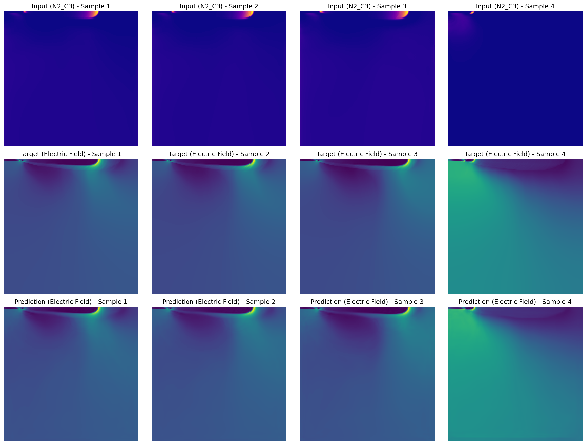

# SmartMapping: Neural Networks for Learning Mappings Between Streamer Light Emissions and Multidimensional Streamer Data

## Dataset

The dataset contains 2D streamer discharge simulation results (from afivo-streamer) in a uniform (nx,ny) grid with the following variables:
- `N2_B3`: FPS light emissions
- `N2_C3`: SPS light emissions  
- `e`: Electron density
- `electric_fld`: Electric field
- `phi`: Electrostatic potential
- `r`: Radial coordinate
- `z`: Axial coordinate
- `rhs`: Right-hand side of Poisson equation
- `output_index`: Output index for each simulation
- `run_number`: Simulation run number

Each variable has shape (n_samples, nx, ny)

## Project Structure

```
smartmapping/
├── models/
│   └── unet.py          # U-Net model implementation
├── data/
│   └── dataset.py       # Data loading utilities
├── train.py             # U-Net training script
├── requirements.txt     # Python dependencies
└── README.md           # This file
```

## Installation

1. Install dependencies:
```bash
pip install -r requirements.txt
```

## Usage

### Training the Model

Train a U-Net to map light emissions to electric field distribution:

```bash
python train.py --data_path $HOME/projects/data/dataset_128.h5 --batch_size 16 --epochs 100
```

### Command Line Arguments

- `--data_path`: Path to the HDF5 dataset (default: $HOME/projects/data/dataset_128.h5)
- `--batch_size`: Batch size for training (default: 16)
- `--epochs`: Number of training epochs (default: 100)
- `--learning_rate`: Learning rate (default: 1e-4)
- `--input_key`: Input data key in HDF5 file (default: N2_C3)
- `--output_key`: Output data key in HDF5 file (default: electric_fld)
- `--normalization_type`: Type of normalization ('standard' or 'minmax', default: standard)
- `--output_dir`: Output directory for checkpoints and plots (default: ./outputs)
- `--save_every`: Save checkpoint every N epochs (default: 10)
- `--plot_every`: Plot predictions every N epochs (default: 20)
- `--num_workers`: Number of data loading workers (default: 4)

### Example Training Commands

```bash
# Basic training
python train.py

# Custom parameters
python train.py --batch_size 32 --epochs 200 --learning_rate 1e-3

# Using MinMax normalization
python train.py --normalization_type minmax

# Example mapping (SPS emissions to electric field)
python train.py --input_key N2_C3 --output_key electric_fld

# Example mapping (SPS emissions to electron density)
python train.py --input_key N2_C3 --output_key e
```

## Model Architecture

The U-Net model includes:
- Encoder path with downsampling and feature extraction
- Decoder path with upsampling and feature reconstruction
- Skip connections between encoder and decoder
- Batch normalization and ReLU activations
- Configurable bilinear or transposed convolution upsampling

## Example Results

Here's an example of the model's predictions after 80 epochs of training:



The visualization shows the input light emissions (SPS), ground truth electric field, and the model's predicted electric field distribution.

## Output

The training process generates:
- Model checkpoints (`best_checkpoint.pth`, `latest_checkpoint.pth`)
- Training curves plot (`training_curves.png`)
- Sample prediction visualizations (`predictions_epoch_X.png`)
- TensorBoard logs in `runs/` directory
